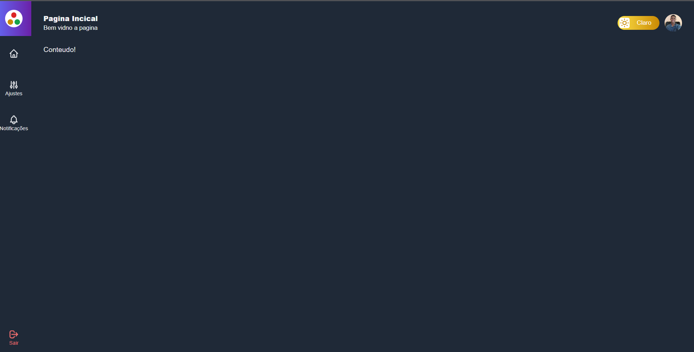

## Template Admin

This is first project with react and next-js of authentication with firebase and typescript. The project involves a screen of login and admin. The User need register  your datas for acess the page of content. 

This is only the page of example, for beginners developers. Already this in construction. This that like you!:)

For test in mode development use:

```bash
npm run dev
# or
yarn dev
```
```
or in mode of Production use:

npm start
# or
next start
```


## Initial Screen


## Admin Screen


